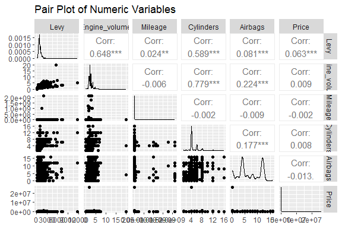

Car Price Prediction
================
Trevor Okinda
2024

- [Student Details](#student-details)
- [Setup Chunk](#setup-chunk)
  - [Source:](#source)
  - [Reference:](#reference)
- [Understanding the Dataset (Exploratory Data Analysis
  (EDA))](#understanding-the-dataset-exploratory-data-analysis-eda)
  - [Load dataset](#load-dataset)
  - [Measures of Frequency](#measures-of-frequency)
  - [Measures of Central Tendency](#measures-of-central-tendency)
  - [Measures of Distribution](#measures-of-distribution)
  - [Measures of Relationship](#measures-of-relationship)
  - [ANOVA](#anova)
  - [Plots](#plots)
- [Preprocessing and Data
  Transformation](#preprocessing-and-data-transformation)
  - [Missing Values](#missing-values)
  - [Omit Rows](#omit-rows)
- [Training Model](#training-model)
  - [Data Splitting](#data-splitting)
  - [Bootstrapping](#bootstrapping)
  - [Cross-validation](#cross-validation)
  - [Training Different Models](#training-different-models)

# Student Details

|                       |                      |
|-----------------------|----------------------|
| **Student ID Number** | 134780               |
| **Student Name**      | Trevor Okinda        |
| **BBIT 4.2 Group**    | C                    |
| **Project Name**      | Car Price Prediction |

# Setup Chunk

**Note:** the following KnitR options have been set as the global
defaults: <BR>
`knitr::opts_chunk$set(echo = TRUE, warning = FALSE, eval = TRUE, collapse = FALSE, tidy = TRUE)`.

More KnitR options are documented here
<https://bookdown.org/yihui/rmarkdown-cookbook/chunk-options.html> and
here <https://yihui.org/knitr/options/>.

### Source:

The dataset that was used can be downloaded here: *\<<a
href="https://www.kaggle.com/datasets/deepcontractor/car-price-prediction-challenge\"
class="uri">https://www.kaggle.com/datasets/deepcontractor/car-price-prediction-challenge\</a>\>*

### Reference:

*\<deepcontractor. (n.d.). Car Price Prediction Challenge \[Dataset\].
Kaggle. <a
href="https://www.kaggle.com/datasets/deepcontractor/car-price-prediction-challenge\"
class="uri">https://www.kaggle.com/datasets/deepcontractor/car-price-prediction-challenge\</a>\>  
Refer to the APA 7th edition manual for rules on how to cite datasets:
<https://apastyle.apa.org/style-grammar-guidelines/references/examples/data-set-references>*

# Understanding the Dataset (Exploratory Data Analysis (EDA))

## Load dataset

``` r
# Load dataset
car_data <- read.csv("car_price_prediction.csv", colClasses = c(
  Levy = "numeric",
  Manufacturer = "character",
  Model = "character",
  Category = "factor",
  Leather_interior = "factor",
  Fuel_type = "factor",
  Engine_volume = "numeric",
  Mileage = "numeric",
  Cylinders = "numeric",
  Gear_box_type = "factor",
  Drive_wheels = "factor",
  Wheel = "factor",
  Color = "factor",
  Airbags = "numeric",
  Price = "numeric"
))

# Display the structure of the dataset
str(car_data)
```

    ## 'data.frame':    19237 obs. of  15 variables:
    ##  $ Levy            : num  1399 1018 NA 862 446 ...
    ##  $ Manufacturer    : chr  "LEXUS" "CHEVROLET" "HONDA" "FORD" ...
    ##  $ Model           : chr  "RX 450" "Equinox" "FIT" "Escape" ...
    ##  $ Category        : Factor w/ 11 levels "Cabriolet","Coupe",..: 5 5 4 5 4 5 4 10 10 5 ...
    ##  $ Leather_interior: Factor w/ 2 levels "No","Yes": 2 1 1 2 2 2 2 2 2 2 ...
    ##  $ Fuel_type       : Factor w/ 7 levels "CNG","Diesel",..: 3 6 6 3 6 2 3 6 3 6 ...
    ##  $ Engine_volume   : num  3.5 3 1.3 2.5 1.3 2 1.8 2.4 2.5 3.5 ...
    ##  $ Mileage         : num  186005 192000 200000 168966 91901 ...
    ##  $ Cylinders       : num  6 6 4 4 4 4 4 4 4 6 ...
    ##  $ Gear_box_type   : Factor w/ 4 levels "Automatic","Manual",..: 1 3 4 1 1 1 1 1 1 1 ...
    ##  $ Drive_wheels    : Factor w/ 3 levels "4x4","Front",..: 1 1 2 1 2 2 2 2 2 1 ...
    ##  $ Wheel           : Factor w/ 2 levels "Left wheel","Righthand drive": 1 1 2 1 1 1 1 1 1 1 ...
    ##  $ Color           : Factor w/ 16 levels "Beige","Black",..: 13 2 2 15 13 15 15 8 2 13 ...
    ##  $ Airbags         : num  12 8 2 0 4 4 12 12 12 12 ...
    ##  $ Price           : num  13328 16621 8467 3607 11726 ...

``` r
# View the first few rows of the dataset
head(car_data)
```

    ##   Levy Manufacturer    Model  Category Leather_interior Fuel_type Engine_volume
    ## 1 1399        LEXUS   RX 450      Jeep              Yes    Hybrid           3.5
    ## 2 1018    CHEVROLET  Equinox      Jeep               No    Petrol           3.0
    ## 3   NA        HONDA      FIT Hatchback               No    Petrol           1.3
    ## 4  862         FORD   Escape      Jeep              Yes    Hybrid           2.5
    ## 5  446        HONDA      FIT Hatchback              Yes    Petrol           1.3
    ## 6  891      HYUNDAI Santa FE      Jeep              Yes    Diesel           2.0
    ##   Mileage Cylinders Gear_box_type Drive_wheels           Wheel  Color Airbags
    ## 1  186005         6     Automatic          4x4      Left wheel Silver      12
    ## 2  192000         6     Tiptronic          4x4      Left wheel  Black       8
    ## 3  200000         4      Variator        Front Righthand drive  Black       2
    ## 4  168966         4     Automatic          4x4      Left wheel  White       0
    ## 5   91901         4     Automatic        Front      Left wheel Silver       4
    ## 6  160931         4     Automatic        Front      Left wheel  White       4
    ##   Price
    ## 1 13328
    ## 2 16621
    ## 3  8467
    ## 4  3607
    ## 5 11726
    ## 6 39493

``` r
# View the dataset in a separate viewer window
View(car_data)
```

## Measures of Frequency

``` r
# Load the required libraries
library(dplyr)
```

    ## 
    ## Attaching package: 'dplyr'

    ## The following objects are masked from 'package:stats':
    ## 
    ##     filter, lag

    ## The following objects are masked from 'package:base':
    ## 
    ##     intersect, setdiff, setequal, union

``` r
library(e1071)

# Measures of Frequency
frequency_count <- car_data %>%
  select(Manufacturer, Model, Category, Leather_interior, Fuel_type, Gear_box_type, Drive_wheels, Wheel, Color) %>%
  summarise_all(~list(table(.)))

# Display frequency counts
frequency_count
```

    ##                                                                                                                                                                                                                                                         Manufacturer
    ## 1 15, 4, 1, 255, 2, 1049, 16, 14, 1069, 26, 9, 91, 13, 91, 2, 78, 1111, 12, 15, 1, 1, 977, 5, 3769, 30, 4, 42, 138, 421, 1, 1, 49, 982, 15, 4, 183, 2076, 4, 48, 289, 4, 660, 397, 17, 1, 54, 37, 2, 3, 2, 1, 7, 2, 20, 441, 275, 76, 1, 3662, 12, 48, 579, 19, 2, 2
    ##                                                                                                                                                                                                                                                                                                                                                                                                                                                                                                                                                                                                                                                                                                                                                                                                                                                                                                                                                                                                                                                                                                                                                                                                                                                                                                                                                                                                                                                                                                                                                                                                                                                                                                                                                                                                                                                                                                                                                                                                                                                                                                                                                                                                                                                                                                                                                                                                                                                                                                                                                                                                                                                                                                                                                                                                                                                                                                                                                                                                                                                                                                                                                                                                                                                                                                                                                                                                                                                                                                                                                                                                                                                                                                                                                                                                                                                                                                                                                                                                                                                                                                                                                                                                                                                                                                                                                                                                                                                                                                                                                                                                                                                                                                                                                                                                                                                                                                                                                                                                                                                                                                                                                                                                                     Model
    ## 1 2, 2, 1, 17, 1, 2, 1, 1, 1, 1, 1, 1, 1, 1, 5, 1, 1, 6, 1, 1, 1, 5, 2, 18, 4, 1, 2, 2, 1, 1, 1, 1, 1, 14, 7, 1, 2, 1, 18, 2, 1, 3, 3, 4, 1, 1, 1, 1, 2, 3, 2, 1, 2, 1, 1, 7, 1, 1, 1, 2, 1, 2, 1, 9, 1, 5, 1, 1, 34, 1, 1, 1, 1, 46, 1, 1, 1, 1, 1, 2, 1, 2, 1, 1, 1, 4, 1, 21, 1, 1, 1, 76, 1, 1, 3, 1, 1, 17, 22, 1, 1, 1, 1, 1, 1, 1, 1, 1, 1, 2, 1, 2, 1, 8, 1, 1, 3, 1, 1, 22, 1, 1, 1, 42, 1, 7, 1, 1, 1, 2, 5, 1, 1, 1, 1, 3, 1, 1, 1, 1, 14, 1, 1, 1, 1, 29, 1, 1, 1, 1, 1, 58, 1, 2, 31, 1, 1, 2, 1, 1, 1, 49, 1, 1, 1, 3, 2, 1, 1, 1, 1, 1, 1, 3, 13, 1, 1, 1, 1, 5, 1, 1, 1, 2, 1, 1, 1, 1, 8, 1, 1, 2, 1, 1, 8, 1, 3, 1, 7, 1, 1, 6, 1, 1, 1, 1, 1, 4, 1, 7, 5, 1, 1, 8, 2, 7, 1, 1, 63, 1, 1, 1, 1, 1, 1, 1, 1, 6, 1, 32, 1, 1, 1, 1, 1, 1, 34, 1, 8, 5, 54, 1, 2, 16, 1, 188, 1, 2, 20, 1, 1, 6, 1, 2, 1, 3, 4, 35, 1, 1, 331, 2, 1, 1, 1, 1, 3, 5, 1, 1, 1, 150, 1, 1, 1, 1, 1, 2, 10, 1, 1, 1, 11, 1, 1, 1, 5, 3, 2, 2, 23, 1, 1, 4, 14, 14, 2, 35, 2, 3, 7, 1, 1, 2, 2, 1, 1, 2, 1, 1, 1, 1, 2, 1, 1, 58, 1, 1, 29, 2, 1, 1, 1, 21, 1, 21, 1, 1, 1, 15, 1, 1, 39, 1, 1, 1, 1, 2, 1, 1, 1, 6, 48, 1, 1, 1, 2, 4, 1, 1, 3, 1, 1, 1, 2, 1, 1, 1, 1, 2, 2, 1, 1, 12, 1, 9, 2, 23, 1, 1, 19, 1, 1, 1, 938, 4, 4, 1, 3, 1, 7, 3, 21, 1, 1, 6, 4, 1, 1, 1, 13, 1, 2, 1, 1, 140, 1, 5, 1, 1, 3, 4, 1, 1, 29, 1, 2, 2, 16, 1, 2, 1, 5, 1, 3, 10, 10, 1, 1, 13, 1, 2, 16, 79, 1, 1, 1, 187, 1, 1, 2, 2, 1, 1, 1, 1, 19, 2, 1, 3, 8, 1, 1, 1, 1, 4, 1, 2, 2, 1, 14, 1, 1, 1, 2, 1, 5, 2, 1, 1, 5, 12, 12, 1, 2, 53, 1, 1, 2, 2, 4, 1, 28, 1, 2, 1, 36, 1, 1, 1, 44, 1, 1, 16, 1, 1, 1, 1, 4, 1, 67, 1, 1, 1, 1, 2, 4, 3, 1, 1, 1, 25, 1, 1, 2, 15, 1, 3, 1, 1, 1, 4, 1, 1, 1, 1, 1, 1, 7, 302, 1, 1, 1, 17, 1, 1, 1, 1, 1, 3, 1, 1, 1, 64, 1, 1, 1, 5, 1, 135, 1, 1, 1, 1, 3, 1, 11, 1, 12, 24, 2, 3, 1, 1, 1, 12, 1, 16, 1, 8, 1, 1, 8, 1, 1, 2, 1, 1, 5, 2, 34, 1, 1, 1, 34, 1, 1, 2, 1, 1, 6, 1, 15, 1, 4, 1, 17, 1, 1, 1, 7, 1, 1, 2, 75, 1, 57, 1, 1, 1, 542, 1, 1, 1, 1, 3, 1, 1, 2, 3, 1, 3, 1, 10, 1, 1, 1, 4, 2, 1, 1, 1, 5, 2, 1, 922, 1, 1, 1, 1, 2, 2, 8, 1, 4, 4, 3, 1, 1, 1, 9, 2, 3, 8, 19, 1, 1, 5, 1, 1, 3, 1, 23, 2, 21, 1, 16, 2, 149, 1, 1, 2, 1, 3, 1, 1, 1, 3, 1, 3, 3, 1, 1, 5, 3, 45, 1, 1, 12, 1, 4, 1, 49, 1, 1, 446, 1, 2, 1, 1, 1, 1, 1, 1, 1, 1, 1, 1, 1, 1, 1, 2, 1, 1, 1, 1, 1, 1, 1, 76, 1, 1, 3, 4, 1, 1, 3, 3, 131, 1, 1, 1, 1, 1, 1, 1, 5, 2, 6, 10, 1, 4, 1, 1, 6, 2, 1, 5, 3, 301, 1, 1, 1, 1, 1, 1, 1, 1, 1, 5, 2, 4, 8, 2, 1, 1, 1, 2, 4, 4, 2, 1, 1, 1, 1, 3, 1, 2, 1, 2, 1, 105, 5, 4, 3, 1, 5, 1, 6, 1, 1, 1, 1, 17, 1, 1, 9, 1, 1, 49, 1, 3, 3, 55, 2, 1, 1, 1, 1, 4, 1, 1, 7, 2, 2, 1, 64, 1, 1, 6, 8, 1, 1, 1, 2, 4, 1, 38, 1, 1, 1, 2, 16, 22, 5, 1, 4, 2, 5, 224, 147, 1, 1, 437, 1, 1, 1, 2, 3, 1, 1, 2, 2, 216, 1, 1, 1, 3, 1, 1, 11, 2, 3, 2, 1, 17, 1, 1, 2, 1, 1, 38, 1, 1, 1, 1, 38, 14, 1, 1, 1, 115, 4, 1, 1, 3, 1, 1, 1, 11, 1, 10, 20, 1, 1, 2, 9, 1, 1, 8, 27, 1, 1, 5, 1, 201, 1, 1, 1, 2, 1, 1, 3, 6, 1, 2, 1, 2, 1, 4, 1, 2, 2, 1, 3, 143, 1, 1, 1, 1, 1, 1, 1, 1, 3, 1, 2, 1, 2, 1, 5, 1, 1, 73, 4, 11, 124, 1, 6, 5, 1, 1, 14, 1, 1, 1, 2, 1, 34, 1, 1, 12, 2, 1, 1, 1, 30, 1, 1, 1, 1, 1, 1, 1, 1, 1, 13, 17, 1, 1, 1, 6, 5, 1, 2, 1, 4, 1, 1, 1, 4, 1, 2, 1, 91, 1, 1, 7, 40, 1, 1, 2, 1, 2, 1, 10, 1, 1, 6, 2, 9, 2, 2, 17, 1, 1, 2, 3, 10, 1, 1, 1, 1, 1, 1, 5, 13, 1, 1, 3, 2, 8, 4, 1, 3, 4, 1, 2, 1, 2, 27, 1, 1, 202, 1, 1, 3, 1, 1, 2, 1, 1, 8, 2, 2, 1, 1, 1, 1, 1, 6, 1, 3, 2, 1, 14, 1, 1, 14, 1, 39, 1, 1, 1, 3, 5, 3, 2, 6, 2, 2, 60, 1, 13, 8, 13, 1, 1, 23, 6, 1, 1, 2, 1, 1, 233, 1, 2, 1, 1, 2, 1, 4, 1, 1, 1, 102, 14, 1, 1, 1, 54, 1, 1, 6, 4, 3, 1, 1, 1, 1, 44, 1, 47, 2, 1, 1, 1, 1, 7, 1, 1, 1, 3, 114, 1, 1, 1, 1, 1, 1, 2, 1, 3, 2, 1, 1, 1, 1, 3, 2, 18, 1, 6, 1, 1, 4, 1, 2, 2, 20, 6, 6, 1, 2, 3, 1, 1, 1083, 2, 1, 1, 1, 1, 1, 1, 118, 1, 2, 1, 1, 1, 1, 1, 1, 2, 1, 1, 1, 1, 2, 2, 2, 1, 1, 18, 1, 1, 1, 1, 2, 1, 4, 1, 1, 3, 1, 32, 1, 1, 1, 33, 1, 1, 1, 1, 9, 1, 2, 1, 2, 1, 5, 1, 1, 2, 5, 1, 9, 14, 3, 1, 1, 1, 1, 1, 2, 1, 1, 167, 1, 1, 1, 2, 1, 1, 2, 1, 1, 1, 3, 1, 3, 1, 4, 175, 1, 1, 17, 1, 1, 1, 19, 1, 1, 1, 1, 1, 2, 1, 10, 86, 1, 33, 1, 1, 2, 2, 173, 1, 1, 2, 2, 7, 5, 1, 1, 1, 1, 1, 5, 1, 12, 1, 1, 1, 22, 1, 1, 2, 3, 1, 1, 1, 4, 2, 1, 1, 1, 2, 533, 1, 2, 1, 4, 6, 1, 1, 1, 17, 2, 22, 1, 3, 3, 15, 4, 1, 1, 1, 3, 1, 4, 1, 1, 15, 1, 1, 1, 3, 1, 1, 7, 1, 1, 1079, 1, 1, 1, 1, 3, 3, 1, 3, 2, 1, 1, 1, 1, 2, 1, 4, 1, 4, 1, 22, 1, 1, 7, 1, 42, 44, 1, 1, 1, 72, 1, 1, 3, 1, 1, 1, 1, 1, 1, 2, 3, 1, 1, 1, 1, 1, 1, 3, 2, 6, 1, 1, 12, 2, 2, 1, 11, 1, 20, 1, 1, 1, 84, 1, 21, 1, 1, 3, 12, 7, 7, 1, 2, 19, 1, 75, 1, 1, 1, 1, 2, 1, 2, 10, 3, 6, 3, 4, 1, 217, 1, 1, 2, 1, 1, 25, 1, 1, 1, 1, 1, 1, 2, 1, 1, 1, 6, 3, 1, 1, 4, 1, 429, 1, 2, 1, 4, 40, 2, 8, 1, 1, 1, 4, 3, 65, 1, 3, 10, 2, 2, 1, 1, 2, 36, 2, 1, 1, 12, 9, 1, 4, 1, 22, 1, 1, 1, 1, 12, 1, 1, 2, 2, 70, 1, 1, 1, 1, 1, 1, 1, 1, 1, 1, 1, 63, 1, 1, 4, 144, 1, 2, 1, 1, 15, 1, 1, 1, 1, 2, 3, 1, 12, 1, 1, 1, 1, 13, 1, 1, 1, 11, 1, 1, 3, 353, 2, 1, 6, 2, 1, 1, 1, 1, 3, 1, 5, 1, 1, 1, 1, 1, 2, 1, 1, 45, 1, 1, 1, 2, 4, 1, 1, 3, 1, 19, 2, 1, 3, 1, 22, 31, 1, 1, 1, 1, 2, 51, 1, 1, 12, 1, 1, 1, 1, 1, 2, 1, 1, 33, 1
    ##                                                Category Leather_interior
    ## 1 36, 532, 233, 2847, 5473, 11, 306, 647, 52, 8736, 364      5283, 13954
    ##                            Fuel_type          Gear_box_type      Drive_wheels
    ## 1 494, 4036, 3578, 1, 892, 10150, 86 13514, 1875, 3102, 746 4058, 12874, 2305
    ##         Wheel
    ## 1 17753, 1484
    ##                                                                               Color
    ## 1 134, 5033, 1396, 187, 179, 145, 322, 2375, 253, 26, 39, 639, 3792, 122, 4489, 106

## Measures of Central Tendency

``` r
# Measures of Central Tendency
central_tendency <- car_data %>%
  summarise(
    mean_Levy = mean(Levy, na.rm = TRUE),
    median_Levy = median(Levy, na.rm = TRUE),
    mean_Engine_volume = mean(Engine_volume, na.rm = TRUE),
    median_Engine_volume = median(Engine_volume, na.rm = TRUE),
    mean_Mileage = mean(Mileage, na.rm = TRUE),
    median_Mileage = median(Mileage, na.rm = TRUE),
    mean_Cylinders = mean(Cylinders, na.rm = TRUE),
    median_Cylinders = median(Cylinders, na.rm = TRUE),
    mean_Airbags = mean(Airbags, na.rm = TRUE),
    median_Airbags = median(Airbags, na.rm = TRUE),
    mean_Price = mean(Price, na.rm = TRUE),
    median_Price = median(Price, na.rm = TRUE)
  )

# Display measures of central tendency
central_tendency
```

    ##   mean_Levy median_Levy mean_Engine_volume median_Engine_volume mean_Mileage
    ## 1  906.8381         781            2.30799                    2      1532236
    ##   median_Mileage mean_Cylinders median_Cylinders mean_Airbags median_Airbags
    ## 1         126000       4.582991                4     6.582627              6
    ##   mean_Price median_Price
    ## 1   18555.93        13172

## Measures of Distribution

``` r
# Measures of Distribution
distribution_measures <- car_data %>%
  summarise(
    var_Levy = var(Levy, na.rm = TRUE),
    sd_Levy = sd(Levy, na.rm = TRUE),
    range_Levy = diff(range(Levy, na.rm = TRUE)),
    skewness_Levy = skewness(Levy, na.rm = TRUE),
    kurtosis_Levy = kurtosis(Levy, na.rm = TRUE),
    
    var_Engine_volume = var(Engine_volume, na.rm = TRUE),
    sd_Engine_volume = sd(Engine_volume, na.rm = TRUE),
    range_Engine_volume = diff(range(Engine_volume, na.rm = TRUE)),
    skewness_Engine_volume = skewness(Engine_volume, na.rm = TRUE),
    kurtosis_Engine_volume = kurtosis(Engine_volume, na.rm = TRUE),
    
    var_Mileage = var(Mileage, na.rm = TRUE),
    sd_Mileage = sd(Mileage, na.rm = TRUE),
    range_Mileage = diff(range(Mileage, na.rm = TRUE)),
    skewness_Mileage = skewness(Mileage, na.rm = TRUE),
    kurtosis_Mileage = kurtosis(Mileage, na.rm = TRUE),
    
    var_Cylinders = var(Cylinders, na.rm = TRUE),
    sd_Cylinders = sd(Cylinders, na.rm = TRUE),
    range_Cylinders = diff(range(Cylinders, na.rm = TRUE)),
    skewness_Cylinders = skewness(Cylinders, na.rm = TRUE),
    kurtosis_Cylinders = kurtosis(Cylinders, na.rm = TRUE),
    
    var_Airbags = var(Airbags, na.rm = TRUE),
    sd_Airbags = sd(Airbags, na.rm = TRUE),
    range_Airbags = diff(range(Airbags, na.rm = TRUE)),
    skewness_Airbags = skewness(Airbags, na.rm = TRUE),
    kurtosis_Airbags = kurtosis(Airbags, na.rm = TRUE),
    
    var_Price = var(Price, na.rm = TRUE),
    sd_Price = sd(Price, na.rm = TRUE),
    range_Price = diff(range(Price, na.rm = TRUE)),
    skewness_Price = skewness(Price, na.rm = TRUE),
    kurtosis_Price = kurtosis(Price, na.rm = TRUE)
  )

# Display measures of distribution
distribution_measures   
```

    ##   var_Levy  sd_Levy range_Levy skewness_Levy kurtosis_Levy var_Engine_volume
    ## 1 213321.2 461.8671      11627      5.448736      85.68154         0.7705408
    ##   sd_Engine_volume range_Engine_volume skewness_Engine_volume
    ## 1        0.8778045                  20               2.185901
    ##   kurtosis_Engine_volume  var_Mileage sd_Mileage range_Mileage skewness_Mileage
    ## 1               19.21497 2.342935e+15   48403869    2147483647         38.89076
    ##   kurtosis_Mileage var_Cylinders sd_Cylinders range_Cylinders
    ## 1         1598.174       1.43984     1.199933              15
    ##   skewness_Cylinders kurtosis_Cylinders var_Airbags sd_Airbags range_Airbags
    ## 1           2.090757           6.483101    18.66385   4.320168            16
    ##   skewness_Airbags kurtosis_Airbags   var_Price sd_Price range_Price
    ## 1       0.08199902        -1.334159 36321220354 190581.3    26307499
    ##   skewness_Price kurtosis_Price
    ## 1       136.4491       18817.67

## Measures of Relationship

``` r
# Correlation matrix for numeric columns
correlation_matrix <- cor(car_data %>% select(Levy, Engine_volume, Mileage, Cylinders, Airbags, Price), use = "complete.obs")

# Covariance matrix for numeric columns
covariance_matrix <- cov(car_data %>% select(Levy, Engine_volume, Mileage, Cylinders, Airbags, Price), use = "complete.obs")

# Display correlation and covariance matrices
correlation_matrix
```

    ##                     Levy Engine_volume       Mileage    Cylinders     Airbags
    ## Levy          1.00000000  0.6482154818  0.0236239493  0.588695208  0.08110692
    ## Engine_volume 0.64821548  1.0000000000 -0.0006407335  0.801845565  0.19715498
    ## Mileage       0.02362395 -0.0006407335  1.0000000000 -0.004610621 -0.01098993
    ## Cylinders     0.58869521  0.8018455645 -0.0046106212  1.000000000  0.14797539
    ## Airbags       0.08110692  0.1971549751 -0.0109899310  0.147975394  1.00000000
    ## Price         0.06329136  0.0329520503 -0.0033390029  0.016204061 -0.16308840
    ##                      Price
    ## Levy           0.063291357
    ## Engine_volume  0.032952050
    ## Mileage       -0.003339003
    ## Cylinders      0.016204061
    ## Airbags       -0.163088395
    ## Price          1.000000000

``` r
covariance_matrix
```

    ##                       Levy Engine_volume       Mileage     Cylinders
    ## Levy          2.133212e+05  2.613134e+02  2.231168e+08  3.052904e+02
    ## Engine_volume 2.613134e+02  7.618168e-01 -1.143578e+04  7.858174e-01
    ## Mileage       2.231168e+08 -1.143578e+04  4.181439e+14 -1.058590e+05
    ## Cylinders     3.052904e+02  7.858174e-01 -1.058590e+05  1.260699e+00
    ## Airbags       1.672631e+02  7.683485e-01 -1.003421e+06  7.418573e-01
    ## Price         5.662497e+05  5.571271e+02 -1.322593e+09  3.524326e+02
    ##                     Airbags         Price
    ## Levy           1.672631e+02  5.662497e+05
    ## Engine_volume  7.683485e-01  5.571271e+02
    ## Mileage       -1.003421e+06 -1.322593e+09
    ## Cylinders      7.418573e-01  3.524326e+02
    ## Airbags        1.993657e+01 -1.410571e+04
    ## Price         -1.410571e+04  3.752262e+08

## ANOVA

``` r
# Load the required library
library(car)
```

    ## Loading required package: carData

    ## 
    ## Attaching package: 'car'

    ## The following object is masked from 'package:dplyr':
    ## 
    ##     recode

``` r
# One-way ANOVA for Category
anova_category <- aov(Price ~ Category, data = car_data)
summary(anova_category)
```

    ##                Df    Sum Sq   Mean Sq F value   Pr(>F)    
    ## Category       10 3.022e+12 3.022e+11   8.351 1.11e-13 ***
    ## Residuals   19226 6.957e+14 3.618e+10                     
    ## ---
    ## Signif. codes:  0 '***' 0.001 '**' 0.01 '*' 0.05 '.' 0.1 ' ' 1

``` r
# One-way ANOVA for Fuel_type
anova_fuel_type <- aov(Price ~ Fuel_type, data = car_data)
summary(anova_fuel_type)
```

    ##                Df    Sum Sq   Mean Sq F value   Pr(>F)    
    ## Fuel_type       6 8.918e+11 1.486e+11   4.096 0.000411 ***
    ## Residuals   19230 6.978e+14 3.629e+10                     
    ## ---
    ## Signif. codes:  0 '***' 0.001 '**' 0.01 '*' 0.05 '.' 0.1 ' ' 1

``` r
# One-way ANOVA for Gear_box_type
anova_gear_box_type <- aov(Price ~ Gear_box_type, data = car_data)
summary(anova_gear_box_type)
```

    ##                  Df    Sum Sq   Mean Sq F value Pr(>F)  
    ## Gear_box_type     3 3.875e+11 1.292e+11   3.557 0.0137 *
    ## Residuals     19233 6.983e+14 3.631e+10                 
    ## ---
    ## Signif. codes:  0 '***' 0.001 '**' 0.01 '*' 0.05 '.' 0.1 ' ' 1

``` r
# Post-hoc test (Tukey's HSD) to see which specific groups differ if ANOVA is significant
tukey_category <- TukeyHSD(anova_category)
tukey_fuel_type <- TukeyHSD(anova_fuel_type)
tukey_gear_box_type <- TukeyHSD(anova_gear_box_type)

# Display post-hoc test results
tukey_category
```

    ##   Tukey multiple comparisons of means
    ##     95% family-wise confidence level
    ## 
    ## Fit: aov(formula = Price ~ Category, data = car_data)
    ## 
    ## $Category
    ##                               diff         lwr         upr     p adj
    ## Coupe-Cabriolet         -3333.2884 -108783.171 102116.5938 1.0000000
    ## Goods wagon-Cabriolet   98332.4858  -11321.880 207986.8514 0.1271829
    ## Hatchback-Cabriolet    -13202.4486 -115899.112  89494.2151 0.9999986
    ## Jeep-Cabriolet           -899.4085 -103287.962 101489.1454 1.0000000
    ## Limousine-Cabriolet    -13049.2399 -223999.630 197901.1506 1.0000000
    ## Microbus-Cabriolet      -6032.7663 -113922.492 101856.9589 1.0000000
    ## Minivan-Cabriolet       -4052.4734 -108906.704 100801.7574 1.0000000
    ## Pickup-Cabriolet         4221.5748 -128538.477 136981.6261 1.0000000
    ## Sedan-Cabriolet        -10352.1485 -112615.671  91911.3735 0.9999999
    ## Universal-Cabriolet       670.0061 -106311.092 107651.1041 1.0000000
    ## Goods wagon-Coupe      101665.7742   53562.356 149769.1925 0.0000000
    ## Hatchback-Coupe         -9869.1601  -38790.842  19052.5217 0.9911555
    ## Jeep-Coupe               2433.8799  -25373.941  30241.7012 1.0000000
    ## Limousine-Coupe         -9715.9515 -196236.530 176804.6270 1.0000000
    ## Microbus-Coupe          -2699.4779  -46631.832  41232.8764 1.0000000
    ## Minivan-Coupe            -719.1850  -36555.879  35117.5094 1.0000000
    ## Pickup-Coupe             7554.8632  -81411.929  96521.6557 1.0000000
    ## Sedan-Coupe             -7018.8601  -34362.724  20325.0036 0.9991665
    ## Universal-Coupe          4003.2945  -37647.807  45654.3964 0.9999999
    ## Hatchback-Goods wagon -111534.9344 -153258.620 -69811.2490 0.0000000
    ## Jeep-Goods wagon       -99231.8943 -140191.352 -58272.4367 0.0000000
    ## Limousine-Goods wagon -111381.7257 -300311.153  77547.7014 0.7190397
    ## Microbus-Goods wagon  -104365.2522 -157604.843 -51125.6616 0.0000000
    ## Minivan-Goods wagon   -102384.9592 -149168.192 -55601.7260 0.0000000
    ## Pickup-Goods wagon     -94110.9110 -188023.064   -198.7584 0.0489706
    ## Sedan-Goods wagon     -108684.6344 -149330.534 -68038.7351 0.0000000
    ## Universal-Goods wagon  -97662.4797 -149035.785 -46289.1741 0.0000001
    ## Jeep-Hatchback          12303.0401   -1846.235  26452.3156 0.1582696
    ## Limousine-Hatchback       153.2087 -184824.772 185131.1892 1.0000000
    ## Microbus-Hatchback       7169.6822  -29667.511  44006.8758 0.9999310
    ## Minivan-Hatchback        9149.9751  -17518.278  35818.2286 0.9907715
    ## Pickup-Hatchback        17424.0234  -68261.549 103109.5953 0.9998967
    ## Sedan-Hatchback          2850.3000  -10363.857  16064.4576 0.9998230
    ## Universal-Hatchback     13872.4547  -20211.872  47956.7818 0.9673457
    ## Limousine-Jeep         -12149.8314 -196956.932 172657.2694 1.0000000
    ## Microbus-Jeep           -5133.3578  -41102.651  30835.9357 0.9999963
    ## Minivan-Jeep            -3153.0649  -28609.046  22302.9164 0.9999991
    ## Pickup-Jeep              5120.9833  -80195.067  90437.0338 1.0000000
    ## Sedan-Jeep              -9452.7400  -20008.554   1103.0737 0.1284977
    ## Universal-Jeep           1569.4146  -31575.006  34713.8350 1.0000000
    ## Microbus-Limousine       7016.4736 -180894.254 194927.2006 1.0000000
    ## Minivan-Limousine        8996.7665 -177187.707 195181.2402 1.0000000
    ## Pickup-Limousine        17270.8147 -185942.078 220483.7074 1.0000000
    ## Sedan-Limousine          2697.0914 -182040.767 187434.9502 1.0000000
    ## Universal-Limousine     13719.2460 -173671.266 201109.7577 1.0000000
    ## Minivan-Microbus         1980.2929  -40502.454  44463.0402 1.0000000
    ## Pickup-Microbus         10254.3411  -81591.210 102099.8926 0.9999997
    ## Sedan-Microbus          -4319.3822  -39931.207  31292.4422 0.9999992
    ## Universal-Microbus       6702.7724  -40787.536  54193.0813 0.9999967
    ## Pickup-Minivan           8274.0482  -79985.921  96534.0178 0.9999999
    ## Sedan-Minivan           -6299.6751  -31248.001  18648.6504 0.9992778
    ## Universal-Minivan        4722.4795  -35396.672  44841.6314 0.9999994
    ## Sedan-Pickup           -14573.7233  -99739.682  70592.2349 0.9999792
    ## Universal-Pickup        -3551.5687  -94328.041  87224.9032 1.0000000
    ## Universal-Sedan         11022.1546  -21733.983  43778.2924 0.9920744

``` r
tukey_fuel_type
```

    ##   Tukey multiple comparisons of means
    ##     95% family-wise confidence level
    ## 
    ## Fit: aov(formula = Price ~ Fuel_type, data = car_data)
    ## 
    ## $Fuel_type
    ##                              diff         lwr        upr     p adj
    ## Diesel-CNG              22121.480   -4651.791  48894.751 0.1834633
    ## Hybrid-CNG               2339.729  -24619.758  29299.217 0.9999770
    ## Hydrogen-CNG            11875.409 -550375.948 574126.766 1.0000000
    ## LPG-CNG                  4799.847  -26701.353  36301.047 0.9993829
    ## Petrol-CNG               8867.760  -17011.230  34746.751 0.9518265
    ## Plugin Hybrid-CNG       15190.862  -50437.669  80819.393 0.9935755
    ## Hybrid-Diesel          -19781.751  -32679.148  -6884.354 0.0001251
    ## Hydrogen-Diesel        -10246.071 -571998.790 551506.648 1.0000000
    ## LPG-Diesel             -17321.633  -38102.743   3459.476 0.1750040
    ## Petrol-Diesel          -13253.720  -23706.041  -2801.398 0.0035053
    ## Plugin Hybrid-Diesel    -6930.618  -68140.364  54279.128 0.9998899
    ## Hydrogen-Hybrid          9535.679 -552225.945 571297.304 1.0000000
    ## LPG-Hybrid               2460.118  -18560.359  23480.594 0.9998664
    ## Petrol-Hybrid            6528.031   -4392.452  17448.514 0.5735255
    ## Plugin Hybrid-Hybrid    12851.133  -48440.293  74142.559 0.9962603
    ## LPG-Hydrogen            -7075.562 -569073.457 554922.334 1.0000000
    ## Petrol-Hydrogen         -3007.648 -564718.456 558703.159 1.0000000
    ## Plugin Hybrid-Hydrogen   3315.453 -561623.847 568254.754 1.0000000
    ## Petrol-LPG               4067.913  -15547.606  23683.432 0.9964806
    ## Plugin Hybrid-LPG       10391.015  -53029.412  73811.442 0.9990649
    ## Plugin Hybrid-Petrol     6323.102  -54500.800  67147.004 0.9999333

``` r
tukey_gear_box_type
```

    ##   Tukey multiple comparisons of means
    ##     95% family-wise confidence level
    ## 
    ## Fit: aov(formula = Price ~ Gear_box_type, data = car_data)
    ## 
    ## $Gear_box_type
    ##                            diff         lwr       upr     p adj
    ## Manual-Automatic      9640.5705  -2424.0508 21705.192 0.1688206
    ## Tiptronic-Automatic  10473.9812    727.4186 20220.544 0.0294436
    ## Variator-Automatic   -1211.9266 -19623.8635 17200.010 0.9982812
    ## Tiptronic-Manual       833.4107 -13487.2606 15154.082 0.9988093
    ## Variator-Manual     -10852.4971 -32044.1361 10339.142 0.5528325
    ## Variator-Tiptronic  -11685.9078 -31649.0228  8277.207 0.4350662

## Plots

``` r
# Load the required libraries
library(ggplot2)
library(GGally)
```

    ## Registered S3 method overwritten by 'GGally':
    ##   method from   
    ##   +.gg   ggplot2

``` r
# Univariate Plots

# Histogram for numeric variables
ggplot(car_data, aes(x = Price)) + 
  geom_histogram(binwidth = 1000, fill = "blue", color = "black") +
  labs(title = "Histogram of Car Prices", x = "Price", y = "Frequency")
```

<!-- -->

``` r
ggplot(car_data, aes(x = Mileage)) + 
  geom_histogram(binwidth = 10000, fill = "green", color = "black") +
  labs(title = "Histogram of Car Mileages", x = "Mileage", y = "Frequency")
```

<!-- -->

``` r
# Box plot for numeric variables
ggplot(car_data, aes(x = Category, y = Price)) +
  geom_boxplot(fill = "orange") +
  labs(title = "Box Plot of Car Prices by Category", x = "Category", y = "Price")
```

<!-- -->

``` r
# Bar chart for categorical variables
ggplot(car_data, aes(x = Fuel_type)) + 
  geom_bar(fill = "purple") +
  labs(title = "Bar Chart of Fuel Types", x = "Fuel Type", y = "Count")
```

<!-- -->

``` r
# Multivariate Plots

# Scatter plot for numeric variables
ggplot(car_data, aes(x = Mileage, y = Price)) + 
  geom_point(color = "red") +
  labs(title = "Scatter Plot of Price vs Mileage", x = "Mileage", y = "Price")
```

<!-- -->

``` r
# Scatter plot with a categorical variable
ggplot(car_data, aes(x = Mileage, y = Price, color = Fuel_type)) + 
  geom_point() +
  labs(title = "Scatter Plot of Price vs Mileage by Fuel Type", x = "Mileage", y = "Price")
```

<!-- -->

``` r
# Pair plot for numeric variables
ggpairs(car_data %>% select(Levy, Engine_volume, Mileage, Cylinders, Airbags, Price), 
        title = "Pair Plot of Numeric Variables")
```

<!-- -->

``` r
# Box plot by a categorical variable
ggplot(car_data, aes(x = Gear_box_type, y = Price, fill = Gear_box_type)) +
  geom_boxplot() +
  labs(title = "Box Plot of Car Prices by Gear Box Type", x = "Gear Box Type", y = "Price")
```

<!-- -->

# Preprocessing and Data Transformation

## Missing Values

``` r
# Summary of missing values
missing_values_summary <- sapply(car_data, function(x) sum(is.na(x)))
missing_values_summary
```

    ##             Levy     Manufacturer            Model         Category 
    ##             5819                0                0                0 
    ## Leather_interior        Fuel_type    Engine_volume          Mileage 
    ##                0                0                0                0 
    ##        Cylinders    Gear_box_type     Drive_wheels            Wheel 
    ##                0                0                0                0 
    ##            Color          Airbags            Price 
    ##                0                0                0

``` r
# Visualize missing values using a heatmap
library(naniar)
library(ggplot2)

# Plot missing values
gg_miss_var(car_data) + labs(title = "Missing Values in Car Dataset")
```

<!-- -->

``` r
# Detailed plot of missing data
vis_miss(car_data) + labs(title = "Detailed Missing Values in Car Dataset")
```

<!-- -->

## Omit Rows

``` r
# Remove rows with missing values
car_data_clean <- na.omit(car_data)

# Summary of missing values after removing rows
missing_values_after <- sapply(car_data_clean, function(x) sum(is.na(x)))
print("Missing Values After Removing Rows:")
```

    ## [1] "Missing Values After Removing Rows:"

``` r
print(missing_values_after)
```

    ##             Levy     Manufacturer            Model         Category 
    ##                0                0                0                0 
    ## Leather_interior        Fuel_type    Engine_volume          Mileage 
    ##                0                0                0                0 
    ##        Cylinders    Gear_box_type     Drive_wheels            Wheel 
    ##                0                0                0                0 
    ##            Color          Airbags            Price 
    ##                0                0                0

# Training Model

## Data Splitting

``` r
library(caTools)

# Split the cleaned dataset into training and testing sets
set.seed(123)  # for reproducibility
split <- sample.split(car_data_clean$Price, SplitRatio = 0.7)
train_data <- subset(car_data_clean, split == TRUE)
test_data <- subset(car_data_clean, split == FALSE)

# Display the dimensions of the training and testing sets
print("Training Set Dimensions:")
```

    ## [1] "Training Set Dimensions:"

``` r
print(dim(train_data))
```

    ## [1] 9587   15

``` r
print("Testing Set Dimensions:")
```

    ## [1] "Testing Set Dimensions:"

``` r
print(dim(test_data))
```

    ## [1] 3831   15

## Bootstrapping

``` r
# Perform bootstrapping on the cleaned dataset
boot_samples <- 1000
bootstrapped_means <- numeric(boot_samples)

for (i in 1:boot_samples) {
  boot_sample <- sample(car_data_clean$Price, replace = TRUE)
  bootstrapped_means[i] <- mean(boot_sample)
}

# Summary of bootstrapped means
summary_boot_means <- summary(bootstrapped_means)
print("Summary of Bootstrapped Means:")
```

    ## [1] "Summary of Bootstrapped Means:"

``` r
print(summary_boot_means)
```

    ##    Min. 1st Qu.  Median    Mean 3rd Qu.    Max. 
    ##   16818   17190   17299   17303   17411   17811

``` r
# Plot histogram of bootstrapped means
hist(bootstrapped_means, main = "Bootstrapped Means", xlab = "Mean Price")
```

<!-- -->

## Cross-validation

``` r
# Load the required library
library(caret)
```

    ## Loading required package: lattice

``` r
# Define training control
ctrl <- trainControl(method = "cv", number = 5)

# Perform cross-validation with linear regression on the cleaned dataset
lm_model <- train(Price ~ ., data = train_data, method = "lm", trControl = ctrl)

# Print the cross-validated linear regression model
print(lm_model)
```

    ## Linear Regression 
    ## 
    ## 9587 samples
    ##   14 predictor
    ## 
    ## No pre-processing
    ## Resampling: Cross-Validated (5 fold) 
    ## Summary of sample sizes: 7670, 7669, 7670, 7669, 7670 
    ## Resampling results:
    ## 
    ##   RMSE      Rsquared  MAE     
    ##   18924.37  0.242117  10350.28
    ## 
    ## Tuning parameter 'intercept' was held constant at a value of TRUE

## Training Different Models

``` r
# Load the required library
library(glmnet)
```

    ## Loading required package: Matrix

    ## Loaded glmnet 4.1-8

``` r
# Prepare data
x_train <- as.matrix(train_data[, -15])  # Exclude the target variable (Price)
y_train <- train_data$Price

# Train Lasso regression model
lasso_model <- cv.glmnet(x_train, y_train, alpha = 1)

# Display the best lambda value
print("Best Lambda for Lasso:")
```

    ## [1] "Best Lambda for Lasso:"

``` r
print(lasso_model$lambda.min)
```

    ## [1] 226.797

``` r
# Display the coefficients of the Lasso model
print("Coefficients of the Lasso model:")
```

    ## [1] "Coefficients of the Lasso model:"

``` r
print(coef(lasso_model, s = "lambda.min"))
```

    ## 15 x 1 sparse Matrix of class "dgCMatrix"
    ##                            s1
    ## (Intercept)      18824.520294
    ## Levy                 2.541746
    ## Manufacturer         .       
    ## Model                .       
    ## Category             .       
    ## Leather_interior     .       
    ## Fuel_type            .       
    ## Engine_volume      567.615559
    ## Mileage              .       
    ## Cylinders            .       
    ## Gear_box_type        .       
    ## Drive_wheels         .       
    ## Wheel                .       
    ## Color                .       
    ## Airbags           -682.848160

``` r
# Train Ridge regression model
ridge_model <- cv.glmnet(x_train, y_train, alpha = 0)

# Display the best lambda value
print("Best Lambda for Ridge:")
```

    ## [1] "Best Lambda for Ridge:"

``` r
print(ridge_model$lambda.min)
```

    ## [1] 3068672

``` r
# Display the coefficients of the Ridge model
print("Coefficients of the Ridge model:")
```

    ## [1] "Coefficients of the Ridge model:"

``` r
print(coef(ridge_model, s = "lambda.min"))
```

    ## 15 x 1 sparse Matrix of class "dgCMatrix"
    ##                             s1
    ## (Intercept)       1.776944e+04
    ## Levy              3.180812e-36
    ## Manufacturer      .           
    ## Model             .           
    ## Category          .           
    ## Leather_interior  .           
    ## Fuel_type         .           
    ## Engine_volume     1.027142e-33
    ## Mileage          -3.191271e-42
    ## Cylinders         4.643399e-34
    ## Gear_box_type     .           
    ## Drive_wheels      .           
    ## Wheel             .           
    ## Color             .           
    ## Airbags          -6.961162e-34

``` r
print(ridge_model)
```

    ## 
    ## Call:  cv.glmnet(x = x_train, y = y_train, alpha = 0) 
    ## 
    ## Measure: Mean-Squared Error 
    ## 
    ##      Lambda Index   Measure        SE Nonzero
    ## min 3068672     1 459635483 107366449       5
    ## 1se 3068672     1 459635483 107366449       5
